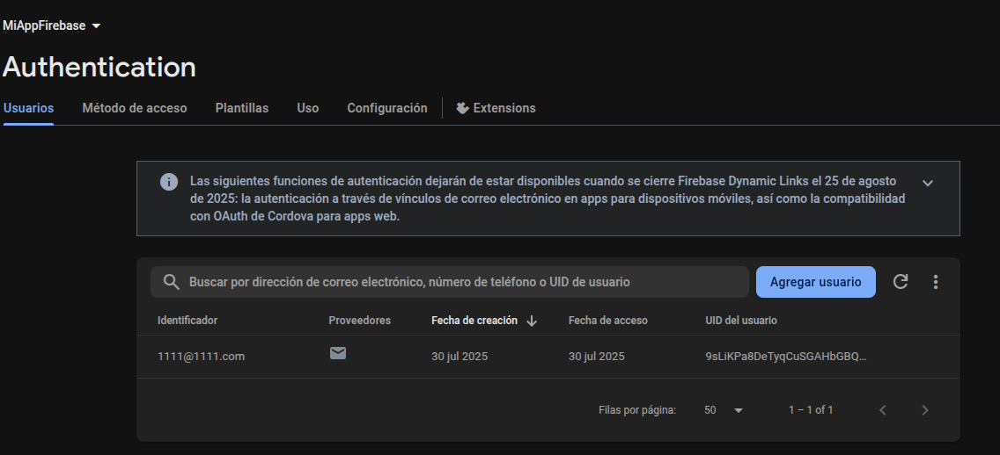

# Mini-App Flutter con Formulario Validado y Autenticación Firebase

## Descripción General

Esta aplicación móvil en Flutter incluye:

- Formulario para ingresar datos personales: nombre, edad y correo electrónico.
- Validación de campos (no vacíos, edad numérica mayor a cero, correo con formato válido).
- Manejo de estado usando `setState`.
- Autenticación con Firebase (registro e inicio de sesión con correo y contraseña).
- Interfaz amigable con mensajes claros mediante `AlertDialog`.
- Código publicado en este repositorio.

## Objetivos de Aprendizaje

- Aplicar conceptos de formularios, validación y estado en Flutter.
- Configurar Firebase Authentication para una app Flutter.
- Usar `setState` para actualizar la UI dinámicamente.
- Publicar y documentar un proyecto en GitHub.

## Requisitos Técnicos

- Formulario con campos:
    - Nombre (obligatorio)
    - Edad (obligatorio, numérico, mayor que cero)
    - Correo electrónico (formato válido)
- Validación con mensajes de error y visualización de datos válidos en un `AlertDialog`.
- Uso explícito de `setState`.
- Autenticación Firebase:
    - Registro y login con email y contraseña.
    - Mensaje de bienvenida al iniciar sesión con éxito.

## Capturas de Pantalla

  
*Pantalla de inicio de sesión.*

  
*Modal de registro de usuario.*

  
*pantalla de registros firabase.*

  
*Formulario de ingreso de datos personales vacios.*

  
*Diálogo mostrando datos ingresados válidos.*      
# Mini-App_Flutter
